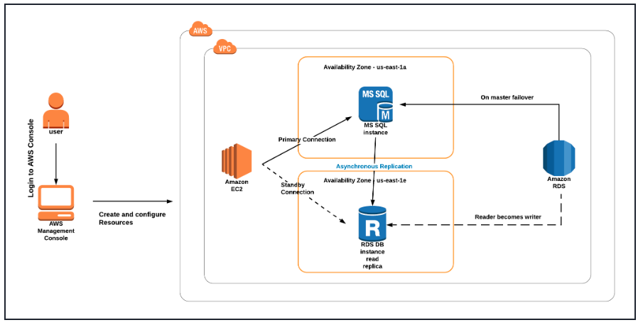

# Amazon RDS Multi-AZ & Read Replica: High Availability Database Architecture with Failover Simulation

## Overview

**The Business Problem:**
Database downtime costs enterprises an average of **$5,600 per minute** according to Gartner. For mission-critical applications, a single database failure can mean lost transactions, frustrated users, and permanent revenue loss. Traditional single-instance databases represent a critical single point of failure in cloud architectures.

**The Solution:**
This project implements a **highly available Amazon Aurora MySQL database** with Multi-AZ deployment and automated failover. By leveraging AWS RDS, we eliminate the operational overhead of self-managed database clustering while achieving:

- **99.99% availability** through automatic failover to standby replica
- **Zero data loss** with synchronous replication to standby instance
- **Automatic recovery** without manual intervention
- **Read scaling** capability using reader endpoints

**Key Outcomes:**
- ✅ Successfully simulated primary instance failure with < 60-second failover
- ✅ Verified complete data durability (no data loss after failover)
- ✅ Demonstrated read/write splitting across 2 Availability Zones
- ✅ Achieved enterprise-grade HA pattern for < $150/month (development tier)

---

## Architecture


### Core Components

| Component | Configuration | Purpose |
|-----------|--------------|---------|
| **Amazon Aurora Cluster** | MySQL-compatible, Multi-AZ | Managed, highly available database |
| **Primary Instance (Writer)** | db.t3.medium, us-east-1a | Handles all write operations, DDL statements |
| **Aurora Replica (Reader)** | db.t3.medium, us-east-1c | Handles read traffic, failover target |
| **Cluster Endpoint** | `myauroracluster.cluster-xxx.rds.amazonaws.com` | Always points to current writer |
| **Reader Endpoint** | `myauroracluster.cluster-ro-xxx.rds.amazonaws.com` | Load balances across read replicas |
| **EC2 Bastion (MyRdsEc2server)** | t2.micro, Amazon Linux 2023 | Secure access point for database operations |
| **Security Groups** | `rds-maz-SG`, `MyEC2Server_SG` | Network access control |

### Key Design Decisions

| Decision | Rationale |
|----------|-----------|
| **Aurora over standard MySQL** | 6-way replicated storage, faster failover, better performance |
| **Multi-AZ deployment** | Automatic failover across AZs eliminates single point of failure |
| **db.t3.medium instance** | Burstable performance for dev/test, cost-effective |
| **Separate security groups** | Defense in depth, least privilege access |
| **Publicly accessible (for lab)** | Enables learning, but production would use private subnets |

---

## Implementation

### Prerequisites
- AWS Account with appropriate permissions
- SSH client (or EC2 Instance Connect)
- Basic SQL knowledge

### Phase 1: EC2 Bastion Setup

**EC2 Instance Details:**
- Name: MyRdsEc2server
- AMI: Amazon Linux 2023 (kernel-6.1)
- Type: t2.micro
- Key Pair: MySSHKey.pem
- Auto-assign Public IP: Enable

**Security Group (MyEC2Server_SG):**
| Type | Protocol | Port | Source | Purpose |
|------|----------|------|--------|---------|
| SSH | TCP | 22 | 0.0.0.0/0 | Administrative access |

**User Data Script (Automated MySQL Installation):**
```bash
#!/bin/bash
wget https://dev.mysql.com/get/mysql80-community-release-el9-5.noarch.rpm
sudo dnf install mysql80-community-release-el9-5.noarch.rpm -y
sudo dnf repolist enabled | grep "mysql.*-community.*"
sudo dnf install mysql -y