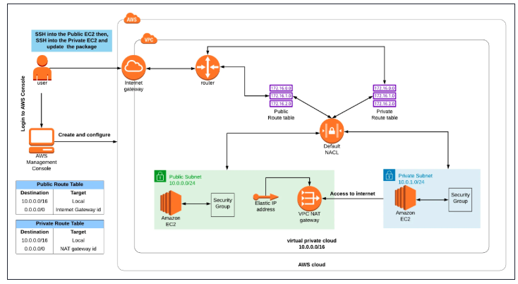

# NAT Gateway - AWS VPC 

## Challenge Overview

As a Security Engineer at ABC Company, I was tasked with building a secure VPC infrastructure that allows a private EC2 instance to access the internet for updates while remaining inaccessible from the outside world. This challenge tested my understanding of AWS networking, VPC components, and security best practices.

## The Business Requirement

**Company ABC's Infrastructure Need:**

- Public EC2 Instance: Host a web application accessible from the internet
- Private EC2 Instance: Host another application that must remain private
- Security Requirement: Private instance needs internet access for updates (yum updates, package installations) but must NOT be directly accessible from the internet
- My Role: Security Engineer - Design and implement the solution


##  Solution Architecture




## My Step-by-Step Implementation

### Phase 1: Building the Network Foundation

#### Task 1: Create the VPC

```bash 
# My VPC Configuration:
VPC Name: MyVPC
CIDR Block: 10.0.0.0/16
Tenancy: Default
Region: us-east-1
```
**Why this CIDR?** The 10.0.0.0/16 range gives me 65,536 IP addresses - plenty for current and future needs.

#### Task 2: Create Subnets (Public & Private)

| Subnet | Name | CIDR | AZ | Auto-assign Public IP	 | Purpose |
|---------| ------------|-------------------|--------|------|------|
|Public |MyPublicSubnet | 10.0.0.0/24| us-east-1a | Enabled
| Private | MyPrivateSubnet |10.0.1.0/24 | us-east-1a | Disabled


**My Design Decision:** I placed both subnets in the same AZ for simplicity, but in production I'd spread them across AZs for high availability.


#### Task 3: Create and Attach Internet Gateway

```bash 
# Create IGW
IGW Name: MyIGW
# Attach to VPC
Attachment: MyVPC
```
**Verification:** Internet Gateway successfully attached to MyVPC