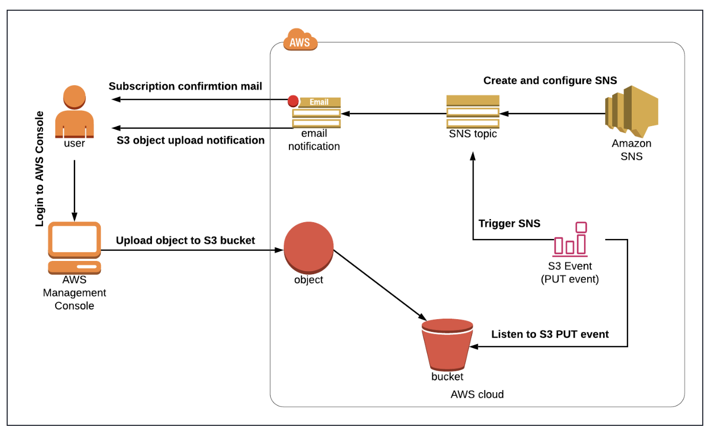

# AWS S3 Event Notification System (Email Alerts via SNS)

## Project Overview

Designed and implemented an event-driven notification system that alerts administrators via email whenever a new object is uploaded to an Amazon S3 bucket.

This solution demonstrates how to integrate storage and messaging services to build real-time notification systems for cloud-based applications.

The architecture is aligned with real-world use cases such as:

- File upload monitoring  
- Audit and compliance tracking  
- Event-driven workflows  
- User activity notifications  

---

## Architecture Overview

### Core Services

- Amazon S3 – Object storage service for file uploads  
- Amazon SNS – Messaging service for real-time notifications  

---

## Architecture Flow

User uploads file to S3 bucket  
→ S3 Event Notification triggered (ObjectCreated:Put)  
→ SNS Topic receives event  
→ Email notification sent to subscriber  

---

## Implementation Steps

### 1. SNS Topic Setup
```bash 
- Created a Standard SNS topic: `mySnsChallengeTopic`  
- Configured an email subscription  
- Confirmed subscription via email  
```
---

### 2. S3 Bucket Configuration
```bash
- Created a globally unique S3 bucket  
- Enabled object upload functionality  
```
---

### 3. SNS Topic Access Policy

Updated the SNS topic policy to allow S3 to publish messages:

```json
{
  "Version": "2012-10-17",
  "Statement": [
    {
      "Sid": "AllowS3Publish",
      "Effect": "Allow",
      "Principal": {
        "Service": "s3.amazonaws.com"
      },
      "Action": "SNS:Publish",
      "Resource": "<SNS_TOPIC_ARN>",
      "Condition": {
        "ArnLike": {
          "aws:SourceArn": "<S3_BUCKET_ARN>"
        }
      }
    }
  ]
}