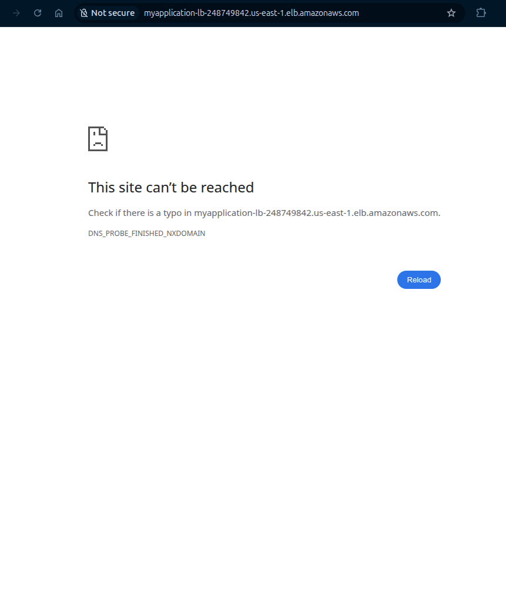
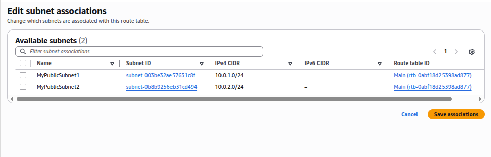

# Toubleshooting VPC,EC2,and Load Balancer Connectivity 

##  Lab Overview
A comprehensive hands-on lab demonstrating network connectivity troubleshooting between VPC components, EC2 instances, and Application Load Balancers in AWS.

## Architecture Diagram


## Lab Objectives
- Create a custom VPC with public subnets across two Availability Zones
- Configure Internet Gateway for internet connectivity
- Set up route tables with proper routing rules
- Launch EC2 instance with Apache web server (via user-data)
- Create and configure Application Load Balancer
- Test load balancer connectivity
- Troubleshoot and fix common connectivity issues
- Validate the complete infrastructure


## Infrastructure Components 

### Network Configuration 


|Component | Name       | Configuaration   | Purpose |
|---------|-------------|-------------------|--------|
|VPC |MyVPC |10.0.0.0/16 |Isolated network environment |
|Subnet 1|MyPublicSubnet1 |10.0.1.0/24 (us-east-1a) |Public-facing resources|
|Subnet 2|MyPublicSubnet2 |10.0.2.0/24 (us-east-1b)  |High availability across AZs|
|Internet Gateway|MyInternetGateway|Attached to MyVPC |Internet connectivity|
|Route Table|PublicRouteTable | 0.0.0.0/0 → IGW |Route internet traffic|


### Compute & Load Balancing

|Component| Name       | Type/Specs  | Configuration|
|---------|-------------|-------------------|--------|
| EC2 Instance | EC2server | t2.micro, Amazon Linux 2023 | Apache web server installed |
| Security Group | EC2server-SG | HTTP (80), SSH (22) | Controls traffic to EC2 |
| Load Balancer | Myapplication-LB | Application Load Balancer |Internet-facing, HTTP:80  |
| Target Group |Apache-TG  | Targets EC2server |Routes traffic to instance  |


## Step-by-Step Implementation

### Task 1-2: VPC Creation

```bash 
# VPC Configuration:
VPC Name: MyVPC
CIDR Block: 10.0.0.0/16
Tenancy: Default
Region: us-east-1

```

### Task 3: Subnet Creation

|Subnet| AZ     | CIDR | Purpose|
|---------|-------------|-------------------|--------|
| MyPublicSubnet1| us-east-1a|10.0.1.0/24 | Primary instance location|
|MyPublicSubnet2 |us-east-1b | 10.0.2.0/24|Load balancer high availability| 

### Task 4: Internet Gateway Configuration
```bash 
# Create and attach Internet Gateway
IGW Name: MyInternetGateway
Attachment: MyVPC
```

### Task 5: Route Table Setup
```bash 
# Create public route table
Route Table: PublicRouteTable
VPC: MyVPC

# Add route for internet access
Destination: 0.0.0.0/0
Target: MyInternetGateway

# Associate subnets
Associated Subnets: MyPublicSubnet1, MyPublicSubnet2

```

### Task 6: EC2 Instance Launch
- Instance Details:
    - Name: EC2server
    - AMI: Amazon Linux 2023
    - Type: t2.micro
    - VPC: MyVPC
    - Subnet: MyPublicSubnet1
    - Auto-assign Public IP: Enable
    - Security Group: EC2server-SG (HTTP, SSH)

**User Data Script:**
```bash 
#!/bin/bash
sudo dnf update -y
sudo dnf install -y httpd
sudo systemctl start httpd
sudo systemctl enable httpd
echo "<html><h1>Response coming from server</h1></html>" | sudo tee /var/www/html/index.html
sudo systemctl restart httpd
```

### Task 7: Load Balancer Creation
- Load Balancer Configuration:
    - Name: Myapplication-LB
    - Scheme: Internet-facing
    - IP Address Type: IPv4
    - VPC: MyVPC
    - Subnets: MyPublicSubnet1, MyPublicSubnet2
    - Security Group: EC2server-SG
    - Listener: HTTP:80

- Target Group Configuration:
    - Name: Apache-TG
    - Target Type: Instances
    - Protocol: HTTP:80
    - VPC: MyVPC
    - Registered Targets: EC2server


### Task 8: Initial Testing
```bash 
# Load Balancer DNS Name
http://Myapplication-LB-xxxxxxxxxx.elb.us-east-1.amazonaws.com
```
**Initial Result: Page not loading - Connectivity issues detected**




## Troubleshooting Process

### Step 1: Verify Internet Gateway Attachment
```bash 
# Check IGW attachment
AWS Console → VPC → Internet Gateways
```
**MyInternetGateway attached to MyVPC**


### Step 2: Check Route Table Associations
```bash 
# Verify subnet associations
AWS Console → VPC → Route Tables → PublicRouteTable
```
**Problem Found:**  Subnets not associated with route table

