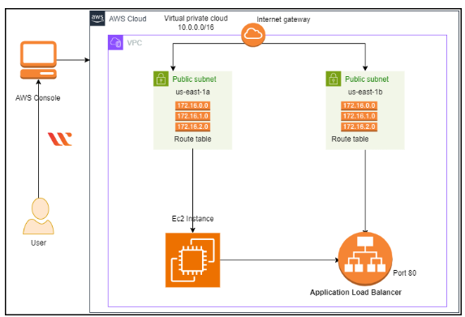
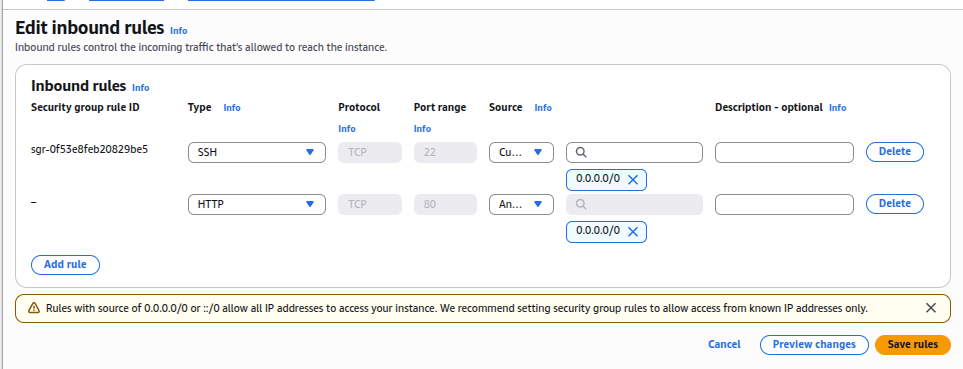
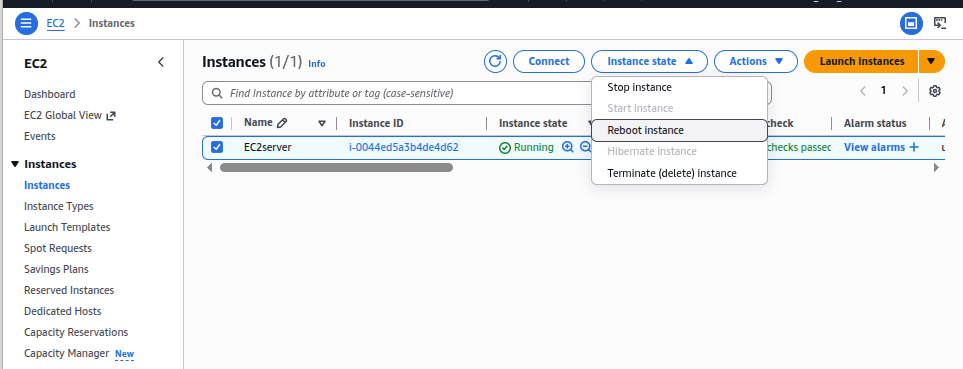
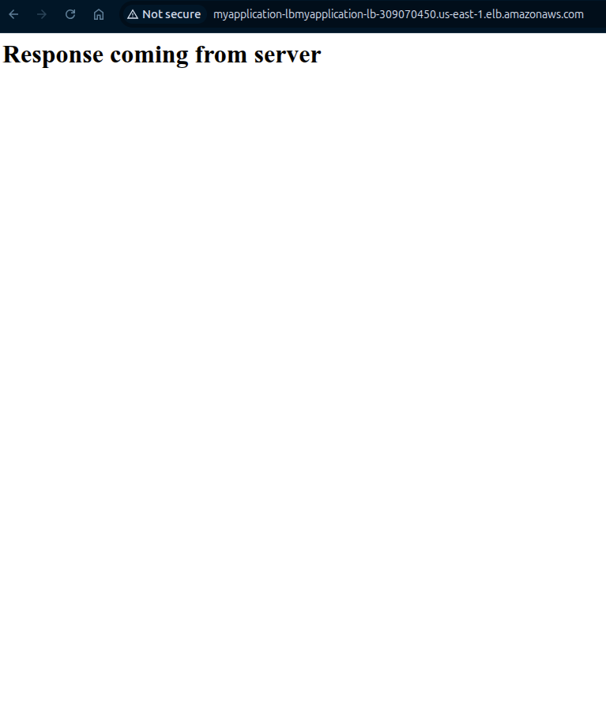
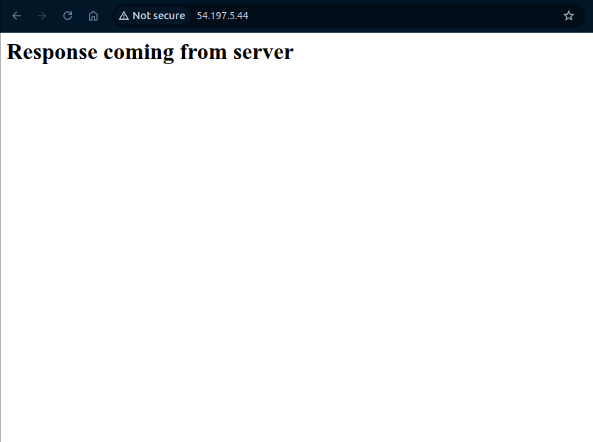

# Toubleshooting VPC,EC2,and Load Balancer Connectivity 

##  Lab Overview
A comprehensive hands-on lab demonstrating network connectivity troubleshooting between VPC components, EC2 instances, and Application Load Balancers in AWS.

## Architecture Diagram



## Lab Objectives
- Create a custom VPC with public subnets across two Availability Zones
- Configure Internet Gateway for internet connectivity
- Set up route tables with proper routing rules
- Launch EC2 instance with Apache web server (via user-data)
- Create and configure Application Load Balancer
- Test load balancer connectivity
- Troubleshoot and fix common connectivity issues
- Validate the complete infrastructure


## Infrastructure Components 

### Network Configuration 


|Component | Name       | Configuaration   | Purpose |
|---------|-------------|-------------------|--------|
|VPC |MyVPC |10.0.0.0/16 |Isolated network environment |
|Subnet 1|MyPublicSubnet1 |10.0.1.0/24 (us-east-1a) |Public-facing resources|
|Subnet 2|MyPublicSubnet2 |10.0.2.0/24 (us-east-1b)  |High availability across AZs|
|Internet Gateway|MyInternetGateway|Attached to MyVPC |Internet connectivity|
|Route Table|PublicRouteTable | 0.0.0.0/0 → IGW |Route internet traffic|


### Compute & Load Balancing

|Component| Name       | Type/Specs  | Configuration|
|---------|-------------|-------------------|--------|
| EC2 Instance | EC2server | t2.micro, Amazon Linux 2023 | Apache web server installed |
| Security Group | EC2server-SG | HTTP (80), SSH (22) | Controls traffic to EC2 |
| Load Balancer | Myapplication-LB | Application Load Balancer |Internet-facing, HTTP:80  |
| Target Group |Apache-TG  | Targets EC2server |Routes traffic to instance  |


## Step-by-Step Implementation

### Task 1-2: VPC Creation

```bash 
# VPC Configuration:
VPC Name: MyVPC
CIDR Block: 10.0.0.0/16
Tenancy: Default
Region: us-east-1

```

### Task 3: Subnet Creation

|Subnet| AZ     | CIDR | Purpose|
|---------|-------------|-------------------|--------|
| MyPublicSubnet1| us-east-1a|10.0.1.0/24 | Primary instance location|
|MyPublicSubnet2 |us-east-1b | 10.0.2.0/24|Load balancer high availability| 

### Task 4: Internet Gateway Configuration
```bash 
# Create and attach Internet Gateway
IGW Name: MyInternetGateway
Attachment: MyVPC
```

### Task 5: Route Table Setup
```bash 
# Create public route table
Route Table: PublicRouteTable
VPC: MyVPC

# Add route for internet access
Destination: 0.0.0.0/0
Target: MyInternetGateway

# Associate subnets
Associated Subnets: MyPublicSubnet1, MyPublicSubnet2

```

### Task 6: EC2 Instance Launch
- Instance Details:
    - Name: EC2server
    - AMI: Amazon Linux 2023
    - Type: t2.micro
    - VPC: MyVPC
    - Subnet: MyPublicSubnet1
    - Auto-assign Public IP: Enable
    - Security Group: EC2server-SG (HTTP, SSH)

**User Data Script:**
```bash 
#!/bin/bash
sudo dnf update -y
sudo dnf install -y httpd
sudo systemctl start httpd
sudo systemctl enable httpd
echo "<html><h1>Response coming from server</h1></html>" | sudo tee /var/www/html/index.html
sudo systemctl restart httpd
```

### Task 7: Load Balancer Creation
- Load Balancer Configuration:
    - Name: Myapplication-LB
    - Scheme: Internet-facing
    - IP Address Type: IPv4
    - VPC: MyVPC
    - Subnets: MyPublicSubnet1, MyPublicSubnet2
    - Security Group: EC2server-SG
    - Listener: HTTP:80

- Target Group Configuration:
    - Name: Apache-TG
    - Target Type: Instances
    - Protocol: HTTP:80
    - VPC: MyVPC
    - Registered Targets: EC2server


### Task 8: Initial Testing
```bash 
# Load Balancer DNS Name
http://Myapplication-LB-xxxxxxxxxx.elb.us-east-1.amazonaws.com
```
**Initial Result: Page not loading - Connectivity issues detected**


## Troubleshooting Process

### Step 1: Verify Internet Gateway Attachment
```bash 
# Check IGW attachment
AWS Console → VPC → Internet Gateways
```
- **MyInternetGateway attached to MyVPC**


### Step 2: Check Route Table Associations
```bash 
# Verify subnet associations
AWS Console → VPC → Route Tables → PublicRouteTable
```
- **Problem Found:**  Subnets not associated with route table


**Fix Applied:** 
- Selected PublicRouteTable
- Subnet Associations tab → Edit subnet associations
- Added both MyPublicSubnet1 and MyPublicSubnet2
- Clicked Save


### Step 3: Verify Security Group Rules
```bash 
# Check inbound rules
AWS Console → EC2 → Security Groups → EC2server-SG
```
- **Problem Found:** HTTP rule missing

**Fix Applied:**
- Edit inbound rules
- Add rule: HTTP, Port 80, Source: 0.0.0.0/0
- Save rules




### Step 4: Reboot EC2 Instance

```bash 
# Reboot to apply changes
AWS Console → EC2 → Instances → EC2server
Instance State → Reboot
``` 




## Task 12-13: SSH into EC2 & Reinstall Apache

```bash 
# Connect via EC2 Instance Connect
sudo su

# Update system
yum -y update

# Reinstall Apache
yum install httpd -y
systemctl start httpd
systemctl enable httpd
systemctl status httpd

# Verify content
echo "<html><h1>Response coming from server</h1></html>" > /var/www/html/index.html
systemctl restart httpd
``` 

## Final Testing Results

### After Troubleshooting:

|Test| URL      | Expected Result | Actual Result|
|---------|-------------|-------------------|--------|
| Load Balancer| http://Myapplication-LB-xxxx.elb.amazonaws.com  |Apache test page |Page loads successfully | 
|EC2 Direct | EC2 Public IP address | Apache test page	| Page loads successfully|
|SSH Access | EC2 Instance Connect| Terminal access|Connected successfully	 |
|Apache Status |systemctl status httpd |Active (running) | Active (running)|

### Load Balancer DNS Working:

```text 
http://Myapplication-LB-xxxx.elb.amazonaws.com
```

**Response:** "Response coming from server"




### EC2 Public IP Working:
```text 
http://<EC2-Public-IP>
```
**Response:** "Response coming from server"



##  Resource Cleanup
To avoid ongoing charges, terminate all resources:
```bash 
# 1. Delete Load Balancer
AWS Console → EC2 → Load Balancers → Myapplication-LB → Delete

# 2. Delete Target Group
AWS Console → EC2 → Target Groups → Apache-TG → Delete

# 3. Terminate EC2 Instance
AWS Console → EC2 → Instances → EC2server → Instance State → Terminate

# 4. Delete Security Group
AWS Console → EC2 → Security Groups → EC2server-SG → Delete

# 5. Delete VPC components
AWS Console → VPC → 
   - Detach and delete Internet Gateway
   - Delete route tables (if not auto-deleted)
   - Delete subnets
   - Delete VPC (MyVPC)
```

##  References & Resources
- VPC User Guide
- EC2 Documentation
- VPC Connectivity Issues
- Security Groups Guide
- systemctl Command Guide


##  Project Repository Structure

```text 
aws-vpc-lb-troubleshooting/
├── README.md                 # This documentation
├── architecture/             # Architecture diagrams
│   └── vpc-lb-architecture.png
├── scripts/                  # Automation scripts
│   ├── user-data.sh          # EC2 user data script
│   └── troubleshooting.sh    # Troubleshooting commands
├── screenshots/              # Lab screenshots
│   ├── 01-vpc-creation.png
│   ├── 02-subnets.png
│   ├── 03-igw-attachment.png
│   ├── 04-route-tables.png
│   ├── 05-ec2-launch.png
│   ├── 06-load-balancer.png
│   ├── 07-target-group.png
│   ├── 08-before-fix.png
│   ├── 13-after-fix.png
│   └── 10-validation.png 

└── docs/                     # Additional documentation
    ├── troubleshooting-guide.md
    └── best-practices.md
```

#AWS #VPC #EC2 #LoadBalancer #Networking #Troubleshooting #CloudComputing #DevOps #Infrastructure #Apache #Linux #HighAvailability