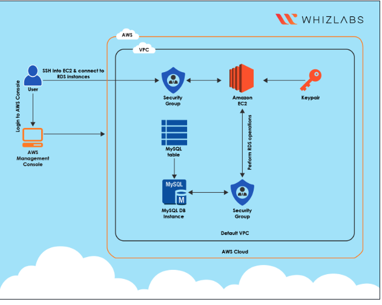

# Connecting an EC2 Instance to an RDS MySQL Database Automatically

## Project Overview

This project demonstrates how to deploy a simple yet realistic cloud architecture where a compute service communicates with a managed database service within AWS.

The goal is to provision an **Amazon EC2 instance** that connects to a **MySQL database hosted on Amazon RDS**. This architecture simulates a common web application backend environment used for testing or development.

The infrastructure uses the AWS Free Tier where possible and follows standard cloud architecture practices for compute and database integration.

Services used in this project include:

- Amazon EC2
- Amazon RDS

---

# Architecture

## Architecture Diagram



### Architecture Description

The architecture consists of:

- A **Compute Layer** using EC2 to host the application environment
- A **Database Layer** using Amazon RDS MySQL
- A **network connection** allowing the EC2 instance to communicate with the RDS database

The EC2 instance acts as the application server while the RDS instance acts as the persistent data storage layer.

---

# Objectives

The purpose of this challenge is to demonstrate the following cloud engineering skills:

- Provisioning compute infrastructure
- Deploying managed databases
- Configuring security groups
- Establishing connectivity between services
- Performing basic database operations

---

# Infrastructure Components

## EC2 Instance Configuration

| Setting | Value |
|------|------|
Instance Name | WebServer-Test |
AMI | Amazon Linux 2023 (Kernel 6.1) |
Instance Type | t2.micro |
Key Pair | MySSHKey |
Security Group | SSH (22), HTTP (80) |
Storage | 8 GB |

Purpose:

- Acts as the **application server**
- Connects to the RDS database
- Performs database operations

---

## RDS Database Configuration

| Setting | Value |
|------|------|
Engine | MySQL |
Instance Type | db.t3.micro |
Storage | 20 GB |
Storage Type | gp2 |
Deployment | Single AZ |
Public Access | Enabled |

Purpose:

- Provides **managed relational database storage**
- Stores application data
- Allows secure connection from EC2

---

# Deployment Steps

## Step 1 – Launch EC2 Instance

Navigate to the EC2 console and launch an instance with the following configuration:

- Amazon Linux 2023 AMI
- Instance type: `t2.micro`
- Enable SSH and HTTP access
- Use or create a key pair for SSH access

Launch the instance and wait until the instance state becomes **Running**.

---

## Step 2 – Create the RDS MySQL Database

Navigate to the RDS console and create a new database.

Configuration:

- Engine: MySQL
- Template: Free Tier
- Instance Class: `db.t3.micro`
- Storage: 20 GB
- Public access: Enabled

Create the database and wait until its status changes to **Available**.

---

## Step 3 – Retrieve the RDS Endpoint

After the database is created:

1. Open the RDS instance
2. Navigate to **Connectivity & Security**
3. Copy the **endpoint URL**

Example endpoint:
test-mysql-db.xxxxxx.us-east-1.rds.amazonaws.com


This endpoint is used by the EC2 instance to connect to the database.

---

## Step 4 – Connect to the EC2 Instance

Use SSH to connect to the EC2 instance:

```bash
ssh -i MySSHKey.pem ec2-user@<EC2-PUBLIC-IP>
```

## Step 5 – Install MySQL Client

Install the MySQL client on the EC2 instance:
```bash
1sudo dnf install mysql -y
```

## Step 6 – Connect to the RDS Database

Use the RDS endpoint to connect:

```bash
mysql -h <RDS-ENDPOINT> -u admin -p
```
Enter the database password when prompted.


## Security Considerations
Security Considerations
- Key security measures implemented include:
- Security groups allowing controlled access
- SSH access restricted via key pairs
- Managed database environment using Amazon RDS

For production environments, additional best practices should include:
- Private RDS deployment
- VPC-based isolation
- IAM database authentication
- Secrets Manager for credential storage


## Project Structure

```text
ec2-rds-connection-project/
│
├── README.md
│
├── architecture/
│   └── architecture-diagram.png
│
├── docs/
│   └── cost-analysis.md
│
├── scripts/
│   └── database-setup.sql
│
├── screenshots/
│   ├── ec2-instance-running.png
│   ├── rds-instance-available.png
│   ├── rds-endpoint.png
│   └── mysql-connection-success.png
│
└── cleanup/
    └── resource-deletion-guide.md
```