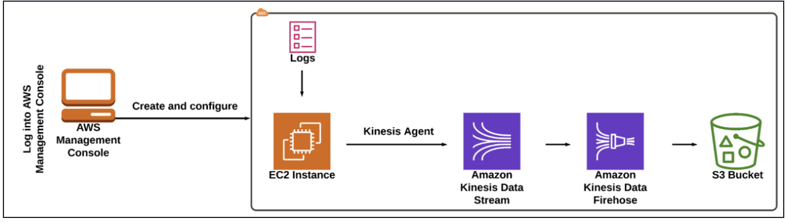

# Real-Time Log Streaming Pipeline with Amazon Kinesis
## End-to-End Data Streaming Project


--

## Table of Contents

- [Project Overview](#project-overview)
- [Architecture Diagram](#architecture-diagram)
- [Technologies Used](#technologies-used)
- [Prerequisites](#prerequisites)
- [Implementation Steps](#implementation-steps)
  - [1. EC2 Instance Setup](#1-ec2-instance-setup)
  - [2. Host Sample Website](#2-host-sample-website)
  - [3. Configure Log Permissions](#3-configure-log-permissions)
  - [4. Create Kinesis Data Stream](#4-create-kinesis-data-stream)
  - [5. Create S3 Bucket](#5-create-s3-bucket)
  - [6. Create Kinesis Data Firehose](#6-create-kinesis-data-firehose)
  - [7. Install and Configure Kinesis Agent](#7-install-and-configure-kinesis-agent)
  - [8. Test the Pipeline](#8-test-the-pipeline)
- [Validation Checklist](#validation-checklist)
- [Monitoring & Metrics](#monitoring--metrics)
- [Troubleshooting](#troubleshooting)
- [Cost Breakdown](#cost-breakdown)
- [Lessons Learned](#lessons-learned)
- [Project Structure](#project-structure)
- [Screenshots](#screenshots)
- [Author](#author)
- [References](#references)

---

## Project Overview

As part of my AWS Solutions Architect training, I built a real-time log streaming pipeline to solve a common enterprise problem: efficiently managing and analyzing log data from EC2-hosted applications.

### The Business Problem

An e-commerce platform generates massive amounts of log data daily. Traditional log management (storing logs locally on EC2 instances) creates several issues:

- Logs are lost when instances terminate
- No centralized storage for analysis
- Difficult to monitor in real-time
- Storage limitations on EC2 volumes

### The Solution

I designed and implemented an end-to-end data streaming pipeline that captures Apache web server logs in real-time and streams them to Amazon S3 for permanent storage and analysis.

### Key Achievements

- ✅ Deployed sample website on EC2 with Apache web server
- ✅ Created Kinesis Data Stream with server-side encryption
- ✅ Configured Kinesis Agent to tail Apache access logs
- ✅ Built Firehose delivery stream to S3
- ✅ Validated end-to-end log streaming within minutes
- ✅ Implemented encryption at rest and in transit

---

## Architecture Diagram 



---

## Technologies Used

| Service | Purpose |
|---------|---------|
| **Amazon EC2** | Hosts the sample website and Apache web server |
| **Apache HTTP Server** | Web server generating access logs |
| **Amazon Kinesis Data Streams** | Real-time log ingestion with encryption |
| **Amazon Kinesis Agent** | Tails log files and publishes to Kinesis |
| **Amazon Kinesis Data Firehose** | Delivers streaming data to S3 |
| **Amazon S3** | Durable, scalable log storage with encryption |
| **AWS IAM** | Instance profile for EC2 permissions |
| **Amazon CloudWatch** | Monitoring metrics for Kinesis and Firehose |


---

## Implementation Steps

### 1. EC2 Instance Setup

**Objective:** Launch an EC2 instance that will host the sample website.

| Parameter | Value |
|-----------|-------|
| **Instance Name** | Demo_Instance |
| **AMI** | Amazon Linux 2023 AMI |
| **Instance Type** | t2.micro |
| **Key Pair** | Created for SSH access |
| **Security Group** | SSH (port 22) + HTTP (port 80) |
| **IAM Instance Profile** | EC2_Role_<RANDOM_NUMBER> |

**Steps:**

1. Navigate to EC2 Dashboard → Instances → Launch Instance
2. Enter name: `Demo_Instance`
3. Select Amazon Linux 2023 AMI
4. Choose t2.micro (free tier eligible)
5. Create or select an existing key pair
6. Configure security group with:
   - SSH (22) from anywhere
   - HTTP (80) from anywhere
7. Under Advanced details, select IAM instance profile: `EC2_Role_<RANDOM_NUMBER>`
8. Launch instance

---

### 2. Host Sample Website

**Objective:** Install Apache web server and deploy a sample website.

#### 2.1 SSH into EC2 Instance

```bash
ssh -i your-key.pem ec2-user@<public-ip-address>
```

#### 2.2 Install Apache Web Server
```bash
# Update system packages
sudo dnf update -y

# Install Apache web server
sudo dnf install -y httpd

# Start Apache service
sudo systemctl start httpd

# Enable Apache to start on boot
sudo systemctl enable httpd

# Verify Apache is running
sudo systemctl status httpd
```

#### 2.3 Download and Deploy Sample Websit
```bash 
# Navigate to HTML folder
cd /var/www/html

# Download sample website template
curl -O -L -A "Mozilla/5.0 (Windows NT 10.0; Win64; x64) AppleWebKit/537.36 (KHTML, like Gecko) Chrome/137.0.0.0 Safari/537.36" "https://labresources.whizlabs.com/094ba567ebb44c80c99f06f70ba6b44a/marvel-master.zip"

# Verify download
ls
# Expected output: marvel-master.zip

# Unzip the template
sudo unzip marvel-master.zip

# List contents
ls
# Expected output: marvel-master  marvel-master.zip

```

#### 4.3 Verify Website
Open a browser and navigate to:
```text
http://<your-instance-public-ip>/marvel-master/
```
You should see the sample website.


--

#### 4.4 Check Access Logs
```bash 
cd /var/log/httpd/
tail -10 access_log
```


### Set File Permissions for HTTPD
Configure permission so the Kinesis Agent can read the log files.

```bash 
# Add httpd group
groupadd httpd

# Add ec2-user to httpd group
usermod -a -G httpd ec2-user

# Log out completely to refresh permissions (exit twice if in sudo)
exit
exit

# SSH back into EC2 instance
ssh -i WhizKey.pem ec2-user@<your-instance-public-ip>

# Verify httpd group exists
groups
# Expected output includes: httpd

# Change group ownership of httpd directory
sudo chown -R root:httpd /var/log/httpd

# Set directory permissions
sudo chmod 2775 /var/log/httpd
sudo find /var/log/httpd -type d -exec sudo chmod 2775 {} \;
```

### Create Kinesis Data Stream

|Parameter| Value |
|---------|---------|
| Stream Name |whiz-data-stream          |
|Capacity Mode      | On-demand (default)         |
|Encryption       |Enabled with AWS managed CMK        |

#### Step-by-Step Instructions
1. Navigate to **Kinesis → Services → Analytics → Kinesis.**
2. Under **Get Started**, select **Kinesis Data Streams → Create data stream.**
3. **Data stream name:** Enter whiz-data-stream
4. Leave all other settings as default → Click **Create data stream.**
5. Wait for the stream status to become **Active.**
6. Click the **Configuration** tab → Scroll to **Encryption** → Click **Edit**.
7. Check **Enable server-side** encryption → Encryption key type: Use **AWS managed CMK** → Click **Save changes.**

---
### Create S3 Bucket
|Parameter| Value|
|---------|------|
|Bucket Name| whiz-demo-logs (add suffix if taken)     |
|Region | US East (N. Virginia) us-east-1 |
| Encryption |SSE-S3 enabled |

#### Step-by-Step Instructions
1. Navigate to **S3 → Services → Storage → S3.**
2. Click **Create bucket.**
3. **Bucket name:** Enter whiz-demo-logs (Note: S3 bucket names are globally unique - add a unique suffix if this name is taken)
4. **Region:** Select **US East (N. Virginia) us-east-1**
5. **Default encryption:**
  - Encryption key type: **Amazon S3 key (SSE-S3)**
  - Bucket key: **Enable**
6. Click **Create bucket.**


---

### Create Kinesis Data Firehose
|Parameter|	Value|
|---------|------|
|Delivery Stream Name|	whiz-data-stream|
|Source|	Amazon Kinesis Data Streams|
|Source Stream|	whiz-data-stream|
|Destination|	Amazon S3|
|S3 Bucket|	whiz-demo-logs|
|Buffer Interval|	60 seconds
