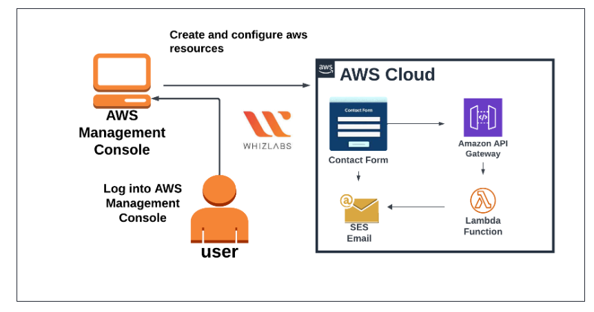

# Serverless Contact Form with AWS 

A serverless contact form built with AWS Lambda, API Gateway, and SES, demonstrating a fully cloud-native approach with near-zero operational cost. This project highlights event-driven architecture, serverless best practices, and cost optimization skills.


## Architecture Diagram 


## Architecture Overview
This contact form allows users to submit their **name, email, and message**, which is then sent as an email using **AWS SES**. The application is **fully serverless**, meaning no backend servers are required, ensuring **scalability, cost efficiency, and reliability**.


## AWS Services Used 

 Service           | Role in Project |
|------------------|----------------|
| **AWS Lambda**    | Executes backend code to send emails |
| **API Gateway**   | Provides a REST endpoint for the frontend |
| **Amazon SES**    | Sends emails automatically from verified domain |
| **IAM Roles**     | Grants Lambda permissions to use SES |
| **CloudWatch**    | Logs and debugging |


## Features 
Fully serverless: No servers to manage  
- Email delivery via AWS SES  
- CORS enabled for frontend integration  
- Error handling and status messages in frontend  
- Node.js Lambda function using AWS SDK v3  


## Cost Analysis
| Service       | Usage / Assumptions        | Monthly Cost Estimate |
| ------------- | -------------------------- | --------------------- |
| Lambda        | 128 MB × 1s × 500 requests | $0 (Free Tier)        |
| API Gateway   | 500 requests               | $0                    |
| SES           | 500 emails                 | $0.05                 |
| Data Transfer | <1 GB outbound             | $0                    |
| Storage (S3)  | <1 MB logs                 | $0                    |

**Total Estimated Monthly Cost: ~$0.05**

## Project Structure 

```text
serverless-contact-form/
├── index.html              # Frontend contact form
├── lambda-function.js      # Backend Lambda code
├── README.md              # This documentation
├── architecture-diagram.png # System architecture
└── screenshots/           # Implementation screenshots
```


## 