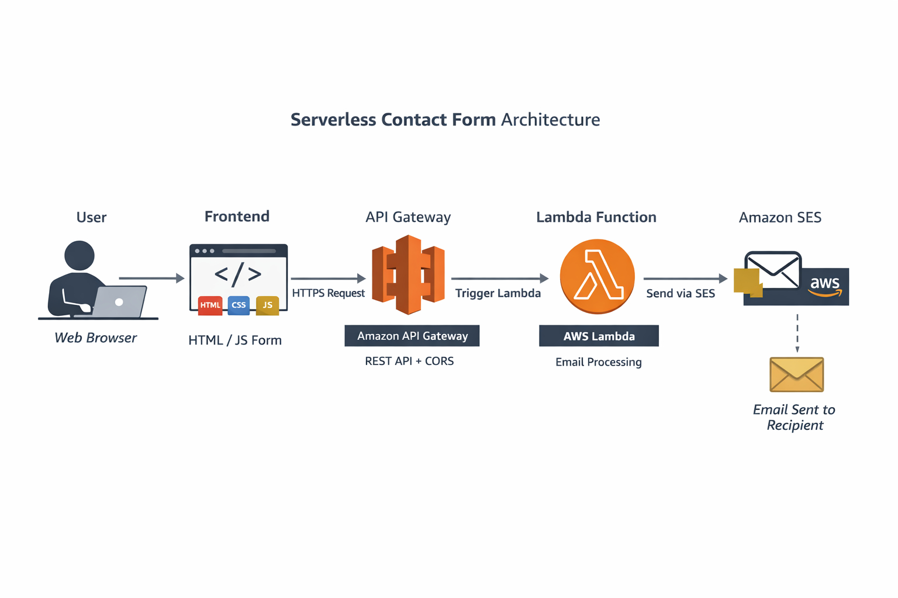

# Serverless Contact Form with AWS 

A serverless contact form built with AWS Lambda, API Gateway, and SES, demonstrating a fully cloud-native approach with near-zero operational cost. This project highlights event-driven architecture, serverless best practices, and cost optimization skills.


## Architecture & Request Flow
1. User submits contact form in browser
2. Browser sends POST request to API Gateway
3. API Gateway triggers Lambda via proxy integration
4. Lambda validates input and sends email using SES
5. SES delivers email to verified recipient




## AWS Services Used 

 Service           | Role in Project |
|------------------|----------------|
| **AWS Lambda**    | Executes backend code to send emails |
| **API Gateway**   | Provides a REST endpoint for the frontend |
| **Amazon SES**    | Sends emails automatically from verified domain |
| **IAM Roles**     | Grants Lambda permissions to use SES |
| **CloudWatch**    | Logs and debugging |


## Features 
Fully serverless: No servers to manage  
- Email delivery via AWS SES  
- CORS enabled for frontend integration  
- Error handling and status messages in frontend  
- Node.js Lambda function using AWS SDK v3  


## Cost Analysis
| Service       | Usage / Assumptions        | Monthly Cost Estimate |
| ------------- | -------------------------- | --------------------- |
| Lambda        | 128 MB × 1s × 500 requests | $0 (Free Tier)        |
| API Gateway   | 500 requests               | $0                    |
| SES           | 500 emails                 | $0.05                 |
| Data Transfer | <1 GB outbound             | $0                    |
| Storage (S3)  | <1 MB logs                 | $0                    |

**Total Estimated Monthly Cost: ~$0.05**

## Project Structure 

```text
serverless-contact-form/
│
├── README.md                ← This documentation
├── architecture/
│   └── architecture.png     ← Architecture Diagram
│
├── lambda/
│   └── index.js              ← Lambda function
│
├── frontend/
│   └── contactform.html      ← Frontend
│
└── docs/
    ├── cost-analysis.md
    └── lessons-learned.md
|
├── Images
    └── screenshots/           ← Implementation screenshots

```


## Engineering Challenges & Solutions
- CORS issues with browser-based APIs
    - Learned how OPTIONS preflight works
    - Fixed by handling CORS correctly in Lambda + API Gateway
- Lambda runtime errors (Node.js ES modules vs CommonJS)
    - Diagnosed "require is not defined"
    - Chose Node.js 20 for compatibility
- AWS SDK versioning
    - Migrated to AWS SDK v3 for SES
    - Reduced dependency size and improved performance
- Debugging with CloudWatch
    - Used logs to trace 502 errors back to runtime failures