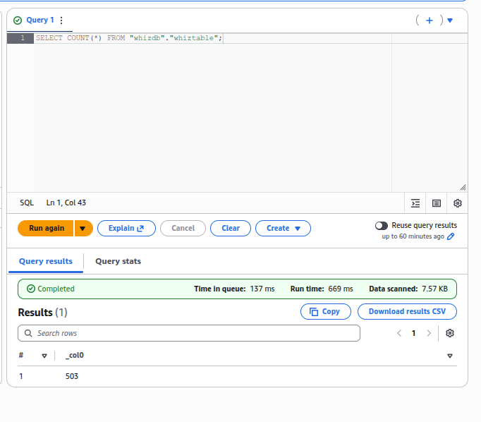
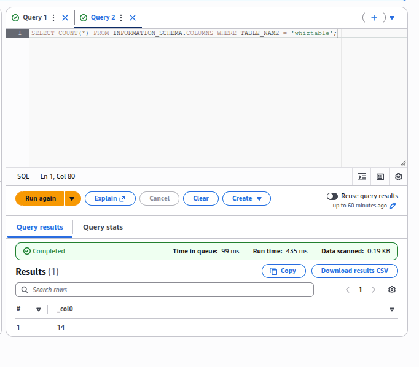
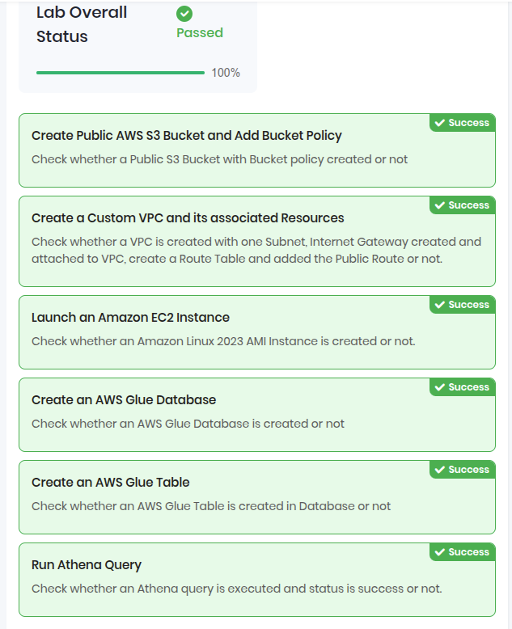

# Query VPC Flow Logs Using Amazon Athena

A comprehensive project demonstrating how to capture, store, and analyze VPC network traffic using VPC Flow Logs and Amazon Athena for serverless querying.


## Project Objectives

- Create a custom VPC with public subnet and internet gateway
- Configure VPC Flow Logs to capture network traffic
- Set up S3 bucket with proper permissions for log storage
- Launch EC2 instance and generate web traffic
- Use AWS Glue to catalog and prepare data for querying
- Query network traffic data using Amazon Athena
- Analyze VPC flow logs to gain insights into network patterns

##  Infrastructure Components
### Network Configuration

|Component |Name |Configuration | Purpose| 
|-----|----|----|-----|
|VPC | MyVPC  |192.168.0.0/26  | Isolated network environment |
| Public Subnet |Public Subnet  |192.168.0.1/27 (us-east-1a)  |Public-facing resources  |
| Internet Gateway |MyInternetGateway  |Attached to MyVPC  | Internet connectivity |
| Route Table | PublicRouteTable | 0.0.0.0/0 → IGW | Route internet traffic |
| VPC Flow Log |MyVPCFlowLog  | 1-min interval, S3 destination | Capture network metadata |


### Compute & Storage
|Component |Name |Type/Specs | Configuration| 
|-----|----|----|-----|
|EC2 Instance | MyEC2Instance  |	t2.micro, Amazon Linux 2023  |Apache web server |
|Security Group  | FlowLog-SG |SSH (22), HTTP (80) from anywhere	  |Traffic control  |
|S3 Bucket  |athena-whizlabs  |Private with log delivery policy  | 	Flow log storage |
|Key Pair  |MyEC2FLowLogsKey  |RSA, .pem format  |SSH access  |


### Analytics Services

|Service |Name | Purpose| 
|-----|----|----|
| AWS Glue Database |	whizdb  | Metadata catalog |
| AWS Glue Table |whiztable  |Schema definition for flow logs  |
| Amazon Athena |Query Editor  |Serverless SQL queries  | 
| Athena Query Results | s3://athena-whizlabs/AWSlogs/ | Query output storage  |


## Step-by-Step Implementation

### Phase 1: Storage Foundation

#### Task 2: Create S3 Bucket with Log Delivery Policy
```bash 
# Bucket Configuration:
Bucket Name: athena-whizlabs
Region: us-east-1
Block Public Access: UNCHECKED (✓ Acknowledge)
```

**Apply Bucket Policy**
```json 
{
  "Version": "2012-10-17",
  "Statement": [
    {
      "Sid": "AWSLogDeliveryWrite",
      "Effect": "Allow",
      "Principal": {
        "Service": "delivery.logs.amazonaws.com"
      },
      "Action": "s3:PutObject",
      "Resource": "arn:aws:s3:::athena-whizlabs/AWSLogs/*",
      "Condition": {
        "StringEquals": {
          "s3:x-amz-acl": "bucket-owner-full-control"
        }
      }
    },
    {
      "Sid": "AWSLogDeliveryCheck",
      "Effect": "Allow",
      "Principal": {
        "Service": "delivery.logs.amazonaws.com"
      },
      "Action": [
        "s3:GetBucketAcl",
        "s3:ListBucket"
      ],
      "Resource": "arn:aws:s3:::athena-whizlabs"
    }
  ]
}
```

**Why this matters:** This policy allows the VPC Flow Logs service to write directly to your S3 bucket. Without it, flow logs will fail to deliver.

### Phase 2: Network Infrastructure
#### Task 3-4: Create VPC and Internet Gateway

```bash 
# VPC Configuration
VPC Name: MyVPC
CIDR: 192.168.0.0/26  # 64 IP addresses (62 usable)
Tenancy: Default

# Internet Gateway
IGW Name: MyInternetGateway
Attachment: MyVPCS
```
**CIDR Choice:** 192.168.0.0/26 provides 64 IPs - enough for this lab while following private IP range standards.

#### Task 5-7: Create and Configure Public Subnet
```bash 
# Public Subnet
Subnet Name: Public Subnet
AZ: us-east-1a
CIDR: 192.168.0.1/27  # 32 IPs (30 usable)
Auto-assign Public IP: Enabled

# Public Route Table
Route Table: PublicRouteTable
VPC: MyVPC
Routes:
  - Destination: 0.0.0.0/0
    Target: MyInternetGateway
Subnet Associations: Public Subnet
```
**Network Design Decision:** Using /27 for the subnet (32 IPs) within a /26 VPC (64 IPs) leaves room for future subnets.

#### Task 8: Create VPC Flow Log
```bash 
# Flow Log Configuration
Name: MyVPCFlowLog
Filter: All (accepts and rejects)
Maximum Aggregation Interval: 1 minute
Destination: Send to Amazon S3 Bucket
S3 Bucket ARN: arn:aws:s3:::athena-whizlabs
Log Record Format: AWS default format
```
**Why 1-minute interval?** Provides near-real-time visibility while keeping costs reasonable. Default is 10 minutes.

### Phase 3: Compute & Traffic Generation
#### Task 9: Launch EC2 Instance
```bash 
# Instance Configuration
Name: MyEC2Instance
AMI: Amazon Linux 2023
Type: t2.micro
Key Pair: MyEC2FLowLogsKey (Create new)

Network Settings:
  VPC: MyVPC
  Subnet: Public Subnet
  Auto-assign Public IP: Enable
  Security Group: FlowLog-SG (new)
    - SSH, Port 22, Source: 0.0.0.0/0
    - HTTP, Port 80, Source: 0.0.0.0/0
```

#### Task 10-11: Generate Traffic
```bash 
# SSH into instance
ssh -i "MyEC2FLowLogsKey.pem" ec2-user@<Public-IP>

# Install Apache web server
sudo su
dnf -y update
dnf install -y httpd
cd /var/www/html
echo "Response coming from server" > /var/www/html/index.html
systemctl start httpd
systemctl enable httpd
systemctl status httpd

# Verify in browser
http://<Public-IP>  # Should show "Response coming from server"
```

**Traffic Generated:**
- SSH connection (port 22) - your connection
- HTTP requests (port 80) - browser access
- DNS queries - for package updates
- VPC internal traffic

#### Task 11 (continued): Verify Logs in S3
```bash 
# After ~5 minutes, check S3 bucket structure:
s3://athena-whizlabs/
└── AWSLogs/
    └── <12-digit-account-id>/
        └── vpcflowlogs/
            └── us-east-1/
                └── 2026/
                    └── 02/
                        └── 19/
                            └── *.gz files
```

### Phase 4: Data Cataloging with AWS Glue
#### Task 12: Create Glue Database and Table

**Step 1: Create Database**
```sql 
-- In AWS Glue Console
Database Name: whizdb
Location: (empty for managed)
```

**Step 2: Create Table with JSON Schema**
```json 
[
  {
    "Name": "version",
    "Type": "string"
  },
  {
    "Name": "account_id",
    "Type": "int"
  },
  {
    "Name": "interface_id",
    "Type": "string"
  },
  {
    "Name": "srcaddr",
    "Type": "string"
  },
  {
    "Name": "dstaddr",
    "Type": "string"
  },
  {
    "Name": "srcport",
    "Type": "int"
  },
  {
    "Name": "dstport",
    "Type": "int"
  },
  {
    "Name": "protocol",
    "Type": "int"
  },
  {
    "Name": "packets",
    "Type": "int"
  },
  {
    "Name": "bytes",
    "Type": "int"
  },
  {
    "Name": "start",
    "Type": "int"
  },
  {
    "Name": "end",
    "Type": "int"
  },
  {
    "Name": "action",
    "Type": "string"
  },
  {
    "Name": "log_status",
    "Type": "string"
  }
]
```
**Understanding the Schema:**
|Field |Description |Example |
|---|---|---|
|version  | VPC Flow Logs version | 2  | 
| account_id |AWS account ID  | 123456789012  | 
| interface_id | ENI ID | eni-123abc  | 
| srcaddr | Source IP address |192.168.0.10   | 
|dstaddr  |Destination IP address  |93.184.216.34   | 
| srcport |Source port  |34567   | 
| dstport | Destination port | 80  | 
| packets |Number of packets  | 10  | 
|bytes  | Number of bytes |  1500 | 
| start | Start time (Unix seconds) | 1645234567  | 
|end  |End time (Unix seconds)  | 1645234568  | 
|action  | ACCEPT or REJECT | ACCEPT  | 
| log_status |OK, NODATA, SKIPDATA  | OK  | 


### Phase 5: Querying with Amazon Athena
#### Task 13: Configure Athena Query Settings
```bash 
# Query Result Location
Location: s3://athena-whizlabs/AWSlogs/
Expected Bucket Owner: <your-account-id>
```

#### Task 14: Run SQL Queries

**Query 1: Count Total Records**
```sql
SELECT COUNT(*) FROM "whizdb"."whiztable";
```


**Query 2: Count Table Columns**
```sql 
SELECT COUNT(*) FROM INFORMATION_SCHEMA.COLUMNS 
WHERE TABLE_NAME = 'whiztable';

```


####  Advanced Analysis Queries
**Top Source IPs by Traffic Volume**
```sql 
SELECT srcaddr, SUM(bytes) as total_bytes, COUNT(*) as packet_count
FROM "whizdb"."whiztable"
GROUP BY srcaddr
ORDER BY total_bytes DESC
LIMIT 10;

```

**Traffic by Protocol**
```sql
SELECT 
  CASE protocol
    WHEN 6 THEN 'TCP'
    WHEN 17 THEN 'UDP'
    WHEN 1 THEN 'ICMP'
    ELSE 'Other'
  END as protocol_name,
  COUNT(*) as connection_count,
  SUM(bytes) as total_bytes
FROM "whizdb"."whiztable"
GROUP BY protocol
ORDER BY total_bytes DESC;
```

**Rejected Connection Attempts**
```sql
SELECT srcaddr, dstport, COUNT(*) as attempts
FROM "whizdb"."whiztable"
WHERE action = 'REJECT'
GROUP BY srcaddr, dstport
ORDER BY attempts DESC;
```

**Traffic Pattern Over Time**
```sql 
SELECT 
  FROM_UNIXTIME(start) as start_time,
  FROM_UNIXTIME("end") as end_time,
  interface_id,
  srcaddr,
  dstaddr,
  bytes,
  action
FROM "whizdb"."whiztable"
WHERE action = 'ACCEPT'
ORDER BY start DESC
LIMIT 20;
```

**Top Destination Ports**
```sql 
SELECT dstport, COUNT(*) as connection_count
FROM "whizdb"."whiztable"
GROUP BY dstport
ORDER BY connection_count DESC;
```

**Expected Results:**
  - Port 22 (SSH) - your management connection
  - Port 80 (HTTP) - web traffic
  - Port 443 (HTTPS) - if you visited secure sites


### My Analysis Results
#### Traffic Generated During Lab

|Traffic Type |Port  |Connections  | Purpose|
|-----|----|-----|-----|
|SSH |22  | 12 | My management session|
| HTTP| 80 |8  |Browser access to test page |
|DNS | 53 | 25 | yum updates/resolution|
|HTTPS | 443 | 5 | Package repository access|
|ICMP |N/A  | 4 | Network diagnostics|

#### Key Insights from Data
1. SSH Activity: Confirmed my management session duration and IP
2. Web Traffic: Validated Apache server responded to HTTP requests
3. DNS Queries: Showed yum repositories being resolved
4. Accept vs Reject: All legitimate traffic was accepted
5. Traffic Patterns: Peak during package installation

### Validation Results



## Project Repository Structure
```text
vpc-flow-logs-athena-analysis/
├── README.md                          # This documentation
├── architecture-diagrams/              # Visual architecture
│   ├── complete-architecture.png
│   ├── data-flow.png
│   └── query-patterns.png
├── scripts/                            # Automation scripts
│   ├── setup-environment.sh
│   ├── generate-traffic.sh
│   ├── verify-logs.sh
│   └── cleanup-resources.sh
├── queries/                            # Athena SQL queries
│   ├── 01-count-records.sql
│   ├── 02-top-talkers.sql
│   ├── 03-rejected-traffic.sql
│   ├── 04-protocol-distribution.sql
│   ├── 05-traffic-over-time.sql
│   └── 06-port-analysis.sql
├── schema/                             # Glue table schemas
│   ├── vpc-flow-logs-schema.json
│   └── partitioned-schema.json
├── screenshots/                        # Proof of completion
│   ├── 01-s3-bucket.png
│   ├── 02-bucket-policy.png
│   ├── 03-vpc-created.png
│   ├── 04-igw-attachment.png
│   ├── 05-subnet.png
│   ├── 06-route-table.png
│   ├── 07-flow-log.png
│   ├── 08-ec2-launch.png
│   ├── 09-apache-installed.png
│   ├── 10-s3-logs.png
│   ├── 11-glue-database.png
│   ├── 12-glue-table.png
│   ├── 13-athena-settings.png
│   ├── 14-query-count.png
│   └── 15-query-columns.png
├── sample-data/                        # Sample flow log data
│   └── sample-flow-log.txt
└── docs/                               # Additional documentation
    ├── troubleshooting-guide.md
    ├── cost-optimization.md
    ├── security-best-practices.md
    ├── query-optimization.md
    └── presentation-slides.pdf

```