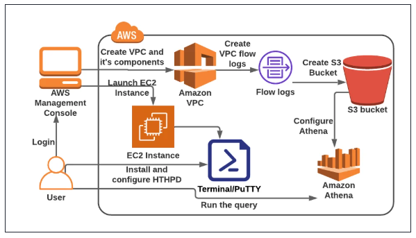

# Query VPC Flow Logs Using Amazon Athena

A comprehensive project demonstrating how to capture, store, and analyze VPC network traffic using VPC Flow Logs and Amazon Athena for serverless querying.

