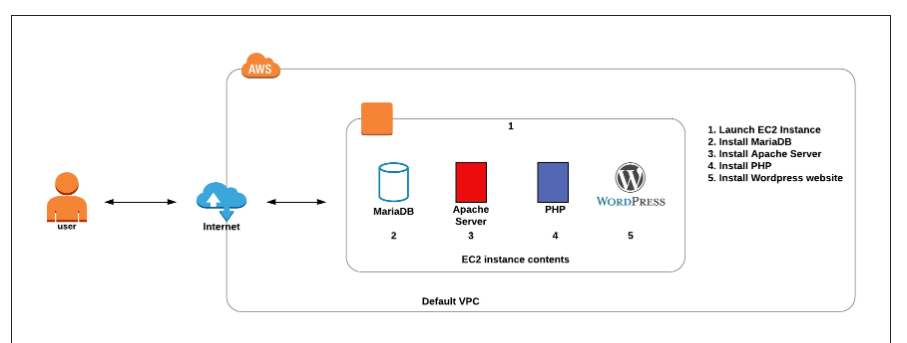

# AWS WordPress Deployment: EC2 LAMP Stack with phpMyAdmin

## Objective
The goal of this project was to deploy a fully functional WordPress website on AWS EC2:

**Technical Requirements:**
- Amazon Linux 2023 AMI with t2.micro instance
- Apache HTTP Server with PHP support
- MariaDB database with WordPress database
- phpMyAdmin for database management
- Proper folder permissions and Apache configuration

**Validation Criteria:**
- WordPress accessible at /mywordpresswebssite
- phpMyAdmin accessible at /phpMyAdmin
- Database user wpuser with proper privileges
- Apache AllowOverride All configured
- Services enabled on system boot
- WordPress installed with user "John Doe"

## Architecdture Diagram 
S