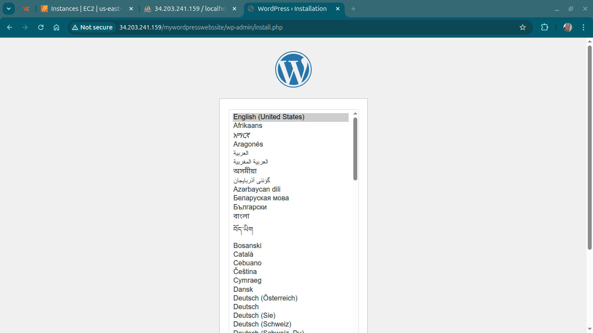
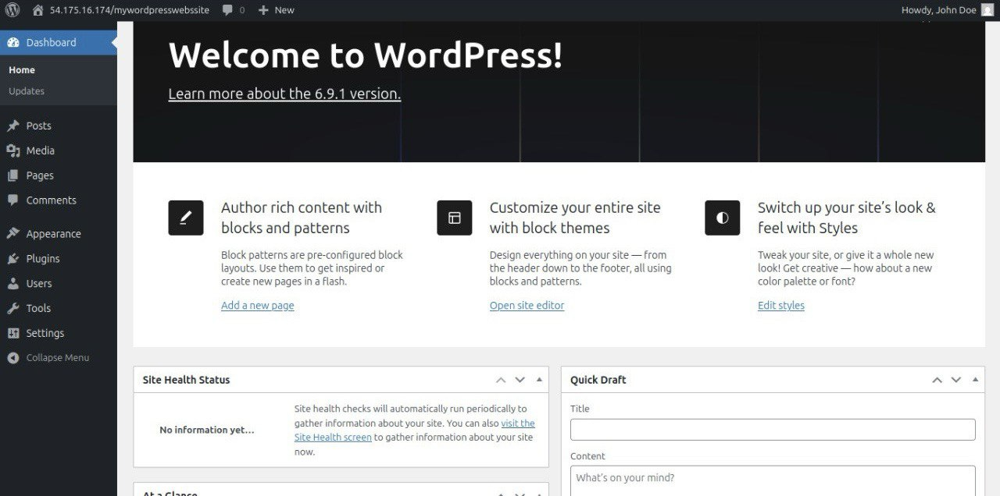

# AWS WordPress Deployment: EC2 LAMP Stack with phpMyAdmin

## Objective
The goal of this project was to deploy a fully functional WordPress website on AWS EC2:

**Technical Requirements:**
- Amazon Linux 2023 AMI with t2.micro instance
- Apache HTTP Server with PHP support
- MariaDB database with WordPress database
- phpMyAdmin for database management
- Proper folder permissions and Apache configuration

**Validation Criteria:**
- WordPress accessible at /mywordpresswebssite
- phpMyAdmin accessible at /phpMyAdmin
- Database user wpuser with proper privileges
- Apache AllowOverride All configured
- Services enabled on system boot
- WordPress installed with user "John Doe"

## Architecdture Diagram 


## Implementation Steps
### Phase 1: AWS Infrastructure Setup

#### Step 1: Launch EC2 Instance
- AMI: Amazon Linux 2023
- Instance Type: t2.micro
- Region: us-east-1 (N. Virginia)
- Security Group Rules:
    - SSH (Port 22) - For terminal access
    - HTTP (Port 80) - For web traffic
    - HTTPS (Port 443) - For secure connections

#### Step 2: Connect via SSH
```bash
ssh -i your-key.pem ec2-user@<PUBLIC-IP>

```

**Verification:** SSH connection established

### Phase 2: Web Stack Installation

#### Step 3: System Update & Apache Installation
```bash
sudo dnf update -y
sudo dnf install httpd -y
sudo systemctl start httpd
sudo systemctl enable httpd
```

**Output Verification:**
```bash
sudo systemctl is-active httpd  # Should return: active
curl http://localhost           # Should show Apache test page 
```

#### Step 4: PHP Installation
```bash
sudo dnf install php php-mysqlnd php-fpm php-json \
                 php-gd php-mbstring php-xml \
                 php-opcache php-curl -y
sudo systemctl restart httpd
```

**Verify PHP:** 
```bash
php -v   #PHP 8....
```

#### Step 5: MariaDB Installation & Security
```bash
sudo dnf install mariadb105-server -y
sudo systemctl start mariadb
sudo systemctl enable mariadb

# Secure the installation
sudo mysql_secure_installation
```
Recommended answers:
Set root password → Y
Remove anonymous users → Y
Disallow root login remotely → Y
Remove test DB → Y
Reload privileges → Y

### Phase 3: Permissions & Directory Setup

#### Step 6: Critical Permission Configuration
```bash 
# Set ownership to Apache user
sudo chown -R apache:apache /var/www

# Set group write permissions with setgid
sudo chmod -R 2775 /var/www

# Apply directory permissions
find /var/www -type d -exec sudo chmod 2775 {} \;

# Apply file permissions
find /var/www -type f -exec sudo chmod 0664 {} \;

# Verify permissions
ls -ld /var/www
# Output: drwxrwsr-x 3 apache apache 4096 Feb  4 10:30 /var/www
```

### Phase 4: phpMyAdmin Installation

### Step 7: Manual phpMyAdmin Setup
Note: Amazon Linux 2023 does not provide phpMyAdmin via dnf, so manual install was required:

```bash
# Download latest phpMyAdmin
sudo wget https://www.phpmyadmin.net/downloads/phpMyAdmin-latest-all-languages.tar.gz

# Extract archive
sudo tar -xvf phpMyAdmin-latest-all-languages.tar.gz

# Rename directory
sudo mv phpMyAdmin-*-all-languages phpMyAdmin

# Set permissions
sudo chown -R apache:apache /var/www/html/phpMyAdmin
sudo chmod -R 755 /var/www/html/phpMyAdmin

# Create temporary directory
sudo mkdir -p /var/www/html/phpMyAdmin/tmp
sudo chmod 777 /var/www/html/phpMyAdmin/tmp
```

### Step 8: phpMyAdmin Configuration
```bash
# Copy configuration template
sudo cp /var/www/html/phpMyAdmin/config.sample.inc.php \
        /var/www/html/phpMyAdmin/config.inc.php

# Edit configuration
sudo nano /var/www/html/phpMyAdmin/config.inc.php
```

```bash
Blowfish secret set in config.inc.php:
$cfg['blowfish_secret'] = 'StrongRandomSecret123!';
```

**Apache restarted:**
```bash
sudo systemctl restart httpd
```

**Verified phpMyAdmin at:** 
```bash
 http://<PUBLIC-IP>/phpMyAdmin   # The EC2 instance Public IP address
``` 

### Phase 5: Database Configuration

#### Step 9: Create WordPress Database 

```sql
-- Connect to MariaDB
sudo mysql -u root -p

-- Execute SQL commands
CREATE DATABASE wordpressdb CHARACTER SET utf8mb4 COLLATE utf8mb4_unicode_ci;
CREATE USER 'wpuser'@'localhost' IDENTIFIED BY 'SecurePass123!';
GRANT ALL PRIVILEGES ON wordpressdb.* TO 'wpuser'@'localhost';
FLUSH PRIVILEGES;
EXIT;
```
**Privilege Verification:**
```sql
SHOW GRANTS FOR 'wpuser'@'localhost';
-- Output: GRANT ALL PRIVILEGES ON `wordpressdb`.* TO 'wpuser'@'localhost'
```

### Phase 6: WordPress Installation
#### Step 10: Download & Configure WordPress

```bash
cd /var/www/html

# Download latest WordPress
sudo wget https://wordpress.org/latest.tar.gz

# Extract WordPress
sudo tar -xzf latest.tar.gz

# Rename to match lab requirements (NOTE: double "s")
sudo mv wordpress mywordpresswebssite

# Set permissions
sudo chown -R apache:apache mywordpresswebssite
sudo chmod -R 755 mywordpresswebssite
```

#### Step 11: WordPress Configuration File
```bash 
# Copy configuration sample
cd /var/www/html/mywordpresswebssite
sudo cp wp-config-sample.php wp-config.php

# Edit configuration
sudo nano wp-config.php
```

**Configuration Added:**
```bash
// Database settings
define('DB_NAME', 'wordpressdb');
define('DB_USER', 'wpuser');
define('DB_PASSWORD', 'SecurePass123!');
define('DB_HOST', 'localhost');
define('DB_CHARSET', 'utf8mb4');
define('DB_COLLATE', '');

// Authentication Unique Keys and Salts
// Generated from: https://api.wordpress.org/secret-key/1.1/salt/
define('AUTH_KEY',         'put your unique phrase here');
define('SECURE_AUTH_KEY',  'put your unique phrase here');
define('LOGGED_IN_KEY',    'put your unique phrase here');
define('NONCE_KEY',        'put your unique phrase here');
define('AUTH_SALT',        'put your unique phrase here');
define('SECURE_AUTH_SALT', 'put your unique phrase here');
define('LOGGED_IN_SALT',   'put your unique phrase here');
define('NONCE_SALT',       'put your unique phrase here');
```

### Phase 7: Apache Configuration
#### Step 12: Enable Apache Overrides

```bash
# Edit Apache configuration
sudo nano /etc/httpd/conf/httpd.conf
```

```apache
<Directory "/var/www/html">
    # Change from:
    # AllowOverride None
    # To:
    AllowOverride All
    
    # Ensure these are also set:
    Require all granted
    Options Indexes FollowSymLinks
</Directory>
```

#### Step 13: Restart & Verify Apache
```bash
# Restart Apache to apply changes
sudo systemctl restart httpd

# Check Apache status
sudo systemctl status httpd
# Should show: Active: active (running)
```

### Phase 8: Final Configuration
#### Step 14: Enable Services on Boot

```bash
sudo systemctl enable httpd
sudo systemctl enable mariadb

# Verify services are enabled
sudo systemctl is-enabled httpd    # Should return: enabled
sudo systemctl is-enabled mariadb  # Should return: enabled
```

#### Step 15: WordPress Web Installation
- **Access WordPress:** http://<PUBLIC-IP>/mywordpresswebssite
- **Select Language:** English (United States)
- **Enter Database Information:**
    - Database Name: wordpressdb
    - Username: wpuser
    - Password: SecurePass123!
    - Database Host: localhost
    - Table Prefix: wp_
- **Run Installation**


- **Configure Site:** 
    - Site Title: AWS WordPress Lab
    - Username: John Doe (Required for lab validation)
    - Password: [Strong Password]
    - Email: [Your Email]
- **Click:** Install WordPress



### Validation & Testing
#### Service Status Verification

```bash
# Apache Service
sudo systemctl is-active httpd      # Expected: active
sudo systemctl is-enabled httpd     # Expected: enabled

# MariaDB Service
sudo systemctl is-active mariadb    # Expected: active
sudo systemctl is-enabled mariadb   # Expected: enabled

# PHP Version
php -v | grep PHP                   # Expected: PHP 8.1.27+

# Disk Space
df -h /var/www                      # Should show available space
``` 

**⚠️ Troubleshooting & Lessons Learned**
Common Issues Encountered
Issue 1: phpMyAdmin "Cannot connect to MySQL server"
Symptoms: phpMyAdmin shows connection error
Root Cause: MariaDB socket authentication for root
Solution:

```bash
# Create MySQL configuration for phpMyAdmin
sudo nano /etc/my.cnf.d/phpmyadmin.cnf
```

Add:
```bash
ini
[client]
socket=/var/lib/mysql/mysql.sock

[mysql]
socket=/var/lib/mysql/mysql.sock

[mysqld]
socket=/var/lib/mysql/mysql.sock
```

**Issue 2: WordPress "Error establishing database connection"**
Symptoms: WordPress installation fails
Root Cause: Incorrect database credentials or permissions
Solution:

```bash
# Verify database user has privileges
sudo mysql -u root -p -e "SHOW GRANTS FOR 'wpuser'@'localhost';"

# Test connection manually
mysql -u wpuser -p wordpressdb
```

**Issue 3: Permission Denied for File Uploads**
Symptoms: WordPress cannot upload media
Root Cause: Incorrect /wp-content/uploads permissions
Solution:

```bash
sudo chown -R apache:apache /var/www/html/mywordpresswebssite/wp-content/uploads
sudo chmod -R 775 /var/www/html/mywordpresswebssite/wp-content/uploads
```

**Critical Requirements**
1. Folder Name: Must be mywordpresswebssite (double "s")
2. Permissions: Must be 2775 for /var/www
3. Apache: Must have AllowOverride All
4. User: WordPress must be installed as "John Doe"
5. Services: Must be enabled on boot

**Cleanup Procedure**
**Step 1: Terminate EC2 Instance**
1. Go to AWS Console → EC2 → Instances
2. Select WordPress instance
3. Actions → Instance State → Terminate
4. Confirm termination

**Step 2: Clean Up Associated Resources**
1. Elastic IPs: Release if allocated
2. Security Groups: Delete custom groups created
3. Key Pairs: Delete or keep for future use
4. EBS Volumes: Automatically deleted with instance

**Step 3: Cost Verification**
1. Check AWS Cost Explorer
2. Verify no running instances
3. Confirm no unexpected charges


**📚 References & Resources**
**Official Documentation**
- [Amazon Linux 2023 User Guide](https://docs.aws.amazon.com/linux/)
- [Apache HTTP Server Documentation
](https://httpd.apache.org/docs/)
- [MariaDB Knowledge Base
](https://mariadb.com/docs)
- [WordPress Installation Guide](https://developer.wordpress.org/advanced-administration/before-install/howto-install/)
- [phpMyAdmin Documentation
](https://www.phpmyadmin.net/docs/)


Lab Validation: PASSED


